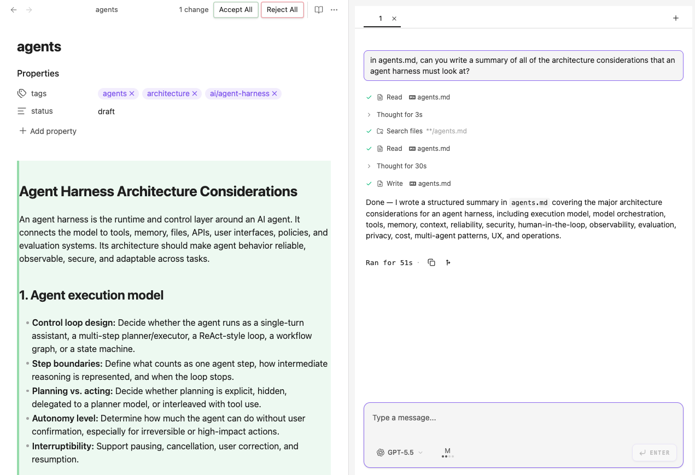
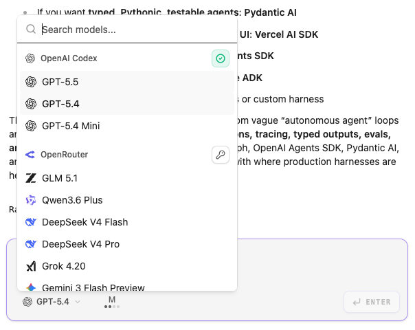

# Franklin

[BANNER] + Badges (license, downloads, contributers, websites, links)

## BYOK/S philosophy
Meet Franklin, your **provider-agnostic** Obsidian agent. Your conversation history and workflows stay the same, **on your machine**, no matter what LLM provider you have. A new top model might be released every month, but your Franklin agent doesn't care. **We believe agent harnesses shouldn't be chains.** ⛓️‍💥

## Features

### ✏️ Making changes
Franklin proposes changes to your vault: it can add, modify, or delete files.

### ⚡️ Model agnostic
Swap LLM providers mid-conversation. Everything else stays the same. 

###  🔐 Secure by design 

Franklin can read and write **only the folders you give it permission to**. By default, this is your vault. No snooping around.

> [!IMPORTANT]
> The model has access to a `grep` tool that it uses for keyword search within files. By default, we try to run this in a **sandboxed environment** that has access only to the folders you allow the model to see. The sandbox needs your computer to have `ripgrep` installed (see [installation instructions](https://ripgrep.dev/download/)).
>
> If you are on Windows or you don't have `ripgrep` on your computer, `grep` will run with unrestricted access. However, in most cases, the agent will not search for words outside your vault. Making the agent more secure is a work in progress.

- [Support]
- [Roadmap]

[Contributing]

[Disclosures]